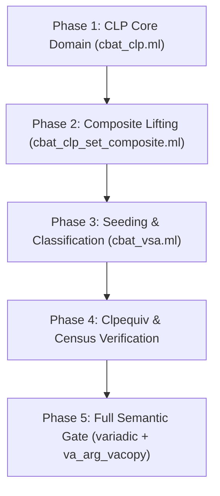

# Research Report: Directional Infinite Sets in the VSA (Directional Strided Intervals / Directional CLPs)

**Target File:** `.scratch/directional-infs/research.md`  
**Status:** Research Complete  
**Date:** September 2026  
**Investigator:** Specialized Static Analysis and Abstract Interpretation Researcher  
**Core Question:** *"How can we move to directional infs in the VSA? That would fix Class 2 (untagged pointer-indirect stack access in variadic/va_arg_vacopy) and make the VSA more precise across the entire binary."*

---

## 1. Executive Summary & Core Insight

### 1.1 The Problem: Class 2 Untagged Pointer-Indirect Stack Accesses
In the hike lifting pipeline, x86-64 ELF binaries are lifted to LLVM IR through value-set analysis (`cbat_vsa`). Two corpus test binaries currently fail the semantic gate exclusively due to the "Class 2" defect:
- `/tmp/corpus/variadic`, callee `sum_n(count, ...)`: lifted output produces `sum = -883326090` (native `280`). The first 6 register-passed arguments succeed, but the 7th stack-spilled argument reads garbage.
- `/tmp/corpus/va_arg_vacopy`, callee `two_pass(count, ...)`: lifted output produces `1 2 3 4 5 0` (native `1 2 3 4 5 6`), failing on the stack-spilled variadic argument.

In both binaries, the x86-64 System V ABI variadic calling convention initializes the `va_list.overflow_arg_area` pointer to `RBP + 0x10`. Relative to callee entry `RSP = 0`, the pushed base pointer has coordinate `RBP = -8`, making `RBP + 0x10 = +8` — a strictly positive offset pointing into the caller's stack frame. In the variadic consumption loop, this pointer is stored to a frame cell (`mem[RBP - 0xC8] <- RAX`), loaded back (`RAX := mem[RBP - 0xC8]`), dereferenced to fetch the argument (`pad:64[mem[RAX]]`), incremented by 8 (`RDX := RAX + 8`), and written back to the cell (`mem[RBP - 0xC8] <- RDX`).

```
[Init]        RAX := RBP + 0x10                 ; +8 (caller incoming arg area)
              mem[RBP - 0xC8, el]:u64 <- RAX    ; stored to va_list cell
... loop ...
[Deref]       RAX := mem[RBP - 0xC8, el]:u64    ; pointer loaded back
              RAX := pad:64[mem[RAX, el]:u32]   ; POINTER-INDIRECT DEREFERENCE
[Step]        RDX := RAX + 8                    ; advanced by stride 8
              mem[RBP - 0xC8, el]:u64 <- RDX    ; loop-carried cell update
```

### 1.2 Where Today's CLP Destroys the Lower Bound
The failure is entirely localized to the interaction of loop widening with the circular representation of infinite sets in Draper's `Clp` domain:

1. **Initial Store is Precise:** At `mem[RBP - 0xC8] <- RAX`, `rewrite_addr` ([cbat_vsa.ml:284](file:///home/tovpr/Documents/hike/src/cbat_vsa/cbat_vsa.ml#L284)) resolves `RBP + 0x10` to the anchored constant `Int(+8)`. The va_list cell at offset `-208` receives singleton `{+8}`.
2. **Loop Widening Triggers `Clp.widen_join`:** Across the loop back-edge, the cell value `{8}` joins with `{16}`, triggering `MemEnv.widen_join` ([cbat_ai_representation.ml:242](file:///home/tovpr/Documents/hike/src/cbat_vsa/cbat_ai_representation.ml#L242)) $\to$ `Val.widen_join` ([cbat_ai_memmap.ml:314](file:///home/tovpr/Documents/hike/src/cbat_vsa/cbat_ai_memmap.ml#L314)) $\to$ `WordSet.widen_join` ([cbat_clp_set_composite.ml:244](file:///home/tovpr/Documents/hike/src/cbat_vsa/cbat_clp_set_composite.ml#L244)) $\to$ `Clp.widen_join` ([cbat_clp.ml:1074](file:///home/tovpr/Documents/hike/src/cbat_vsa/cbat_clp.ml#L1074)):
   ```ocaml
   else if subset p1 p2 then
     if equal p1 p2 then p1 else
     let step = step_of p2 in
     if W.is_zero step then top (bitwidth p2)
     else infinite ((base_of p2), step)
   ```
3. **Circular Modulo Normalization Erases the Bound:** In `Clp.infinite` ([cbat_clp.ml:99](file:///home/tovpr/Documents/hike/src/cbat_vsa/cbat_clp.ml#L99)):
   ```ocaml
   let infinite (b, s) : t =
     ...
     let div, twos = factor_2s s in
     let step = W.div s div in
     let base = W.modulo b step in       (* 8 mod 8 = 0 *)
     let cardn = dom_size ~width:(width + 1) (width - twos) in
     create base ~step ~cardn
   ```
   For $b = 8$ and $s = 8$, `base = W.modulo 8 8 = 0`. The widened set becomes `{0..0xFFFFFFFFFFFFFFF8}^inf`, which represents the circular residue class of all 8-aligned 64-bit words ($x \equiv 0 \pmod 8$).
4. **Channel 2 Rejection:** Channel 2 (`is_seed`, [cbat_vsa.ml:2896](file:///home/tovpr/Documents/hike/src/cbat_vsa/cbat_vsa.ml#L2896)) requires reloaded addresses to be a bounded, finite subset of the frame neighborhood (`-65536L, 65536L`). Because today's infinite CLP spans the entire 64-bit address ring (including negative numbers like `0xFFFFFFFFFFFFFFF8 = -8`), `is_seed` explicitly rejects `is_infinite ws` ([cbat_vsa.ml:2909](file:///home/tovpr/Documents/hike/src/cbat_vsa/cbat_vsa.ml#L2909)).
5. **Downstream Cascade:** The dereference is not seeded $\implies$ no `vsa_info` tag $\implies$ `compute_sub_sig`'s `has_positive` check ([hike.ml:154](file:///home/tovpr/Documents/hike/src/hike.ml#L154)) never fires $\implies$ callee is not granted the `hike_stack` parameter $\implies$ `bil2llvm.ml` emits pointer arithmetic relative to uninitialized local frame memory instead of rebasing to `hike_stack + offset` ([bil2llvm.ml:887](file:///home/tovpr/Documents/hike/src/bil2llvm.ml#L887)).

### 1.3 The Core Insight: Directional Infinite Rays vs Circular Residue Classes
In machine execution, memory pointers do not wrap around. An induction variable $p_{k+1} = p_k + 8$ initialized at $p_0 = 8$ generates an **ascending ray** in the linear integer domain:
$$\{ 8 + 8n \mid n \ge 0 \} = [8, +\infty) \cap (8\mathbb{Z})$$
This set is strictly bounded below by $+8$. Every reachable address is strictly positive and anchor-relative.

Today's CLP domain fails because it conflates two distinct mathematical concepts under a single boolean flag `is_inf = true`:
1. **Modular Residue Classes:** $\{ x \in \mathbb{Z}/2^w\mathbb{Z} \mid x \equiv base \pmod{2^k} \}$, required for circular overflow and bitwise operations.
2. **Directional Rays:** Semi-infinite strided intervals $[lo, +\infty)_s$ or $(-\infty, hi]_s$ on the linear order of words, required for induction variables, loop counters, and walked stack pointers.

By moving to **Directional Infinite Sets** (`Finite`, `Ascending`, `Descending`, `Circular`), the VSA can retain the stable lower bound $lo = 8$ during loop widening. As a consequence:
- `min_elem` returns `Some 8` (not `0`).
- Channel 2 can safely seed the access because the address set is proven to be a subset of the non-negative stack space ($lo \ge 0$).
- `classify` emits `Infinite (8L, hi)`.
- `is_positive_kind` fires ($8\text{L} > 0\text{L}$).
- `hike_stack` is granted, and `rebase_addr` emits byte-correct GEPs into the caller's stack frame.
- **Both `variadic` and `va_arg_vacopy` flip from FAIL to PASS.**

---

## 2. Theoretical Foundations & Literature Comparison

### 2.1 The Two Fundamental Paradigms in Static Binary Analysis

| Dimension | Balakrishnan & Reps Paradigm (Strided Intervals) | Modular/Circular Paradigm (Granger, Navas et al., Draper CLP) |
| :--- | :--- | :--- |
| **Primary Sources** | Balakrishnan & Reps (CC 2004, TOPLAS 2010) | Granger (IJCM 1989); Navas et al. (APLAS 2012, TOPLAS 2015); Draper CBAT |
| **Underlying Domain** | $\mathbb{Z}_{\bot}^{\top}$ or non-wrapping integer intervals $[l, u]$ with stride $s$ | Modular ring $\mathbb{Z}/2^w\mathbb{Z}$ (residue classes $a\mathbb{Z}_{2^w} + b$) |
| **Infinite Sets** | Directional: $[l, +\infty)$, $(-\infty, u]$, $(-\infty, +\infty)$ | Circular: $b + s\mathbb{Z}_{2^w}$ where $b = b \bmod s$, cardinality $2^{w-k}$ |
| **Widening Rule** | Stable bound preservation: extrapolate moving bound to $\pm\infty$ | Collapse to residue class: $base = b \bmod s$, cardn $= 2^{w-k}$ |
| **Strengths** | Retains loop induction lower/upper bounds; natural for memory & stack indexing | Exact for bitwise masking, modular arithmetic, signed/unsigned wrap |
| **Weaknesses** | Awkward handling of intentional integer overflow and bitwise ops | Destroys directional bounds on loop widening; erases non-negativity |

### 2.2 Balakrishnan & Reps: Strided Intervals and Stable-Bound Widening
In *"Analyzing Memory Accesses in x86 Executables"* (CC 2004) and *"WYSINWYX: What You See Is Not What You eXecute"* (ACM TOPLAS 2010), Balakrishnan and Reps define a Strided Interval (SI) as:
$$s[l, u] \stackrel{\text{def}}{=} \{ x \mid l \le x \le u \text{ and } x \equiv l \pmod s \}$$
where $s$ is the stride, $l$ is the lower bound, and $u$ is the upper bound. Bounds $l$ and $u$ can take values in $\mathbb{Z} \cup \{-\infty, +\infty\}$.

The foundational widening operator $\nabla$ over strided intervals defined in Balakrishnan & Reps (§5.1) preserves stable bounds:
$$s_1[l_1, u_1] \ \nabla \ s_2[l_2, u_2] = s'[l', u']$$
where:
$$s' = \gcd(s_1, s_2, |l_1 - l_2|)$$
$$l' = \begin{cases} l_1 & \text{if } l_1 = l_2 \\ -\infty & \text{if } l_2 < l_1 \end{cases}$$
$$u' = \begin{cases} u_1 & \text{if } u_1 = u_2 \\ +\infty & \text{if } u_2 > u_1 \end{cases}$$
When widening a loop induction variable that increments by 8 starting from 8, we have $l_1 = l_2 = 8$ and $u_1 = 8 < u_2 = 16$. Because the lower bound $l_1 = 8$ has not moved, **widening preserves $l' = 8$ and extrapolates only the upper bound $u' = +\infty$**. The resulting interval $8[8, +\infty)$ asserts that every reachable value is $\ge 8$.

### 2.3 The Modular/Circular Paradigm: Granger, Navas et al., and Draper CLP
- **Philippe Granger (IJCM 1989), *"Static Analysis of Arithmetical Congruences"*:** Granger introduced the congruence domain $a\mathbb{Z} + b$, representing infinite periodic sets of integers. In modular machine arithmetic ($2^w$), congruences wrap around cleanly because $2^w$ is a multiple of $2^k$.
- **Jorge A. Navas, Peter Schachte, Harald Søndergaard, Peter J. Stuckey (APLAS 2012, ACM TOPLAS 2015):** In *"Signedness-Agnostic Program Analysis: Precise Integer Bounds for Low-Level Code"* and *"Interval Analysis and Machine Arithmetic: Why Signedness Ignorance Is Bliss"*, Navas et al. formalized **Wrapped Intervals (WI)** and **Wrapped Strided Intervals (WSI)**. A wrapped interval $[l, u]$ on $\mathbb{Z}/2^w\mathbb{Z}$ represents the arc of values traversed moving from $l$ to $u$ in modular order. If $l > u$, the interval wraps around $2^w-1 \to 0$. WSIs handle both signed and unsigned interpretations uniformly, excelling at low-level bitwise operations.
- **Draper CBAT CLP (`cbat_clp.ml`):** Draper's Circular Linear Progression domain took the pure congruence/residue-class approach:
  $$\{ base + n \cdot step \mid 0 \le n < cardn \}$$
  When $cardn \cdot step \ge 2^w$, CBAT deemed the set "infinite" and collapsed it to a circular residue class. To establish a canonical representation for residue classes, CBAT enforced:
  $$base = b \bmod step$$
  This modulo reduction ensures that all infinite sets with the same stride and residue class compare equal. **However, this canonicalization discards the linear origin $lo$**, converting $[8, +\infty)_8$ into the residue class $8\mathbb{Z}_{2^{64}}$, which contains $0, -8, -16, \dots$.

### 2.4 Simon & King: Landmarks vs Directional Widening
Axel Simon and Andy King (*"Widening Polyhedra with Landmarks"*, APLAS 2006) introduced landmark-directed extrapolation, which hike already faithfully implements in the words lane (`AI.selective_widen_extrapolate`, [cbat_ai_representation.ml:250](file:///home/tovpr/Documents/hike/src/cbat_vsa/cbat_ai_representation.ml#L250)).

However, landmarks cannot solve Class 2 for two fundamental reasons:
1. **Scope Limitation:** In hike, memory cells carry no landmarks ([AGENTS.md line 122](file:///home/tovpr/Documents/hike/AGENTS.md#L122); `memories = MemEnv.widen_join e1.memories e2.memories` in [cbat_ai_representation.ml:289](file:///home/tovpr/Documents/hike/src/cbat_vsa/cbat_ai_representation.ml#L289)).
2. **Absence of Guard Boundaries:** Landmark acquisition (`observe_unsat`) requires a conditional jump where a branch constraint meets the variable and yields an empty intersection. In variadic functions, the `va_list` overflow pointer is walked unconditionally until a counter or format string terminates the loop. The pointer itself is **never compared against any boundary**. Therefore, no landmark can ever be acquired for the pointer.

Directional infinite sets provide the exact domain-level solution: stable-bound widening extrapolates the unconstrained upper bound while holding the lower bound constant by construction.

---

## 3. Domain Representation: Extending `Clp.t`

### 3.1 Type Definition
In `src/cbat_vsa/cbat_clp.ml`, `type t` is currently:
```ocaml
(* Today: circular infinite flag *)
type t = { base : word; step : word; cardn : word; is_inf : bool }
[@@deriving bin_io, sexp, compare]
```
We replace the boolean `is_inf` with an explicit 4-way direction type:

```ocaml
type direction =
  | Finite
  | Ascending   (* Bounded below by base; step > 0; unconstrained above *)
  | Descending  (* Bounded above by base; step > 0; unconstrained below *)
  | Circular    (* Full residue class modulo step; base = base mod step *)
[@@deriving bin_io, sexp, compare]

type t = {
  base : word;
  step : word;
  cardn : word;
  dir : direction;
}
[@@deriving bin_io, sexp, compare]
```

### 3.2 Semantic Concretization $\gamma(p)$
Let $w$ be the bitwidth of the CLP, and $W = \mathbb{Z}/2^w\mathbb{Z}$:

1. **Finite ($p.dir = \text{Finite}$):**
   $$\gamma(p) = \{ (p.base + n \cdot p.step) \bmod 2^w \mid 0 \le n < p.cardn \}$$
2. **Ascending ($p.dir = \text{Ascending}$):**
   A ray starting at $p.base$ and proceeding upwards in the unsigned integer order:
   $$\gamma(p) = \{ p.base + n \cdot p.step \mid n \ge 0 \text{ and } p.base + n \cdot p.step \le 2^w - 1 \}$$
   Here, $p.base$ is the exact lower bound: $\min \gamma(p) = p.base$.
3. **Descending ($p.dir = \text{Descending}$):**
   A ray ending at $p.base$ and proceeding downwards in the unsigned integer order:
   $$\gamma(p) = \{ p.base - n \cdot p.step \mid n \ge 0 \text{ and } p.base - n \cdot p.step \ge 0 \}$$
   Here, $p.base$ is the exact upper bound: $\max \gamma(p) = p.base$.
4. **Circular ($p.dir = \text{Circular}$):**
   The full modular residue class (identical to today's `is_inf = true`):
   $$\gamma(p) = \{ x \in W \mid x \equiv p.base \pmod{p.step} \}$$
   where $p.base = p.base \bmod p.step$, and $p.step = 2^k$.

### 3.3 Algebraic Properties and Canonical Forms
To guarantee that `equal` and `compare` remain syntactic and sound:
- **Finite Canonicalization:** If $cardn = 0$, $p = \bot_w$ (`base = 0, step = 0, cardn = 0, dir = Finite`). If $cardn = 1$, $step = 0$.
- **Ascending Canonicalization:** $step$ is non-zero. If $base + step > 2^w - 1$, the set has only 1 element, canonicalized to `Finite` singleton. `cardn` is set to the exact number of non-wrapping points:
  $$cardn = 1 + \left\lfloor \frac{2^w - 1 - base}{step} \right\rfloor$$
- **Descending Canonicalization:** $step$ is non-zero. If $base < step$, the set has only 1 element, canonicalized to `Finite` singleton. `cardn` is set to $1 + \lfloor base / step \rfloor$.
- **Circular Canonicalization:** $base = base \bmod step$. $step$ is factored into $2^k$. $cardn = 2^{w-k}$.
- **Top:** $\top_w$ is represented as `Circular` with $base = 0$, $step = 1$, $cardn = 2^w$.
- **Lattice Height and Termination:** The domain height is finite ($O(w)$ for stride divisibility $\times$ interval bounds). Any sequence of joins/widenings terminates in at most $w + 2$ steps.

---

## 4. Operation-by-Operation Audit & Exact Semantics

### 4.1 `widen_join (p1 : t) (p2 : t) : t`
Widening is the point of origin for directional infinite sets.

```ocaml
let widen_join (p1 : t) (p2 : t) : t =
  if is_bottom p1 then top (bitwidth p2)
  else if subset p1 p2 then
    if equal p1 p2 then p1
    else
      let width = bitwidth p2 in
      let step = step_of p2 in
      if W.is_zero step then top width
      else
        match min_elem p1, max_elem p1, min_elem p2, max_elem p2 with
        | Some lo1, Some hi1, Some lo2, Some hi2 ->
          let lo_stable = W.(=) lo1 lo2 in
          let hi_stable = W.(=) hi1 hi2 in
          let hi_grew = W.(>) hi2 hi1 in
          let lo_grew = W.(<) lo2 lo1 in
          if lo_stable && hi_grew then
            (* Stable lower bound: extrapolate upper bound to +inf *)
            create_ascending ~width ~base:lo1 ~step
          else if hi_stable && lo_grew then
            (* Stable upper bound: extrapolate lower bound to -inf *)
            create_descending ~width ~base:hi1 ~step
          else
            (* Both bounds moved, or wrapping occurred -> Circular residue class *)
            infinite ((base_of p2), step)
        | _ -> infinite ((base_of p2), step)
  else join p1 p2
```
*Exact Semantics:* When $\{8\} \ \nabla \ \{8, 16\}$, $lo_1 = lo_2 = 8$ is stable, while $hi$ grew from $8$ to $16$. The operator produces `Ascending { base = 8; step = 8; ... }`.

### 4.2 `min_elem` and `max_elem`
The extrema functions are consulted by `classify`, `is_seed`, and `bounds_of`:

```ocaml
let min_elem (p : t) : word option =
  if is_bottom p then None
  else match p.dir with
  | Finite -> nearest_succ (W.zero (bitwidth p)) p
  | Ascending -> Some p.base    (* By definition, base is the lower bound *)
  | Descending ->
    (* Smallest non-negative element: base mod step *)
    Some (W.modulo p.base p.step)
  | Circular ->
    (* Circular residue class wraps to 0 if 0 is in the residue class *)
    nearest_succ (W.zero (bitwidth p)) p

let max_elem (p : t) : word option =
  if is_bottom p then None
  else match p.dir with
  | Finite -> nearest_pred (W.ones (bitwidth p)) p
  | Ascending ->
    (* Largest element <= ones on the grid *)
    let max_wd = W.ones (bitwidth p) in
    let diff = W.sub max_wd p.base in
    let rem = W.modulo diff p.step in
    Some (W.sub max_wd rem)
  | Descending -> Some p.base   (* By definition, base is the upper bound *)
  | Circular ->
    nearest_pred (W.ones (bitwidth p)) p
```
*Behavior on Class 2:* For `Ascending { base = 8; step = 8 }`, `min_elem` returns `Some 8`. When converted via `Word.to_int64`, it yields `8L > 0L`.

### 4.3 `subset (p1 : t) (p2 : t) : bool`
The subset operator must avoid the wrapping-end bug where `finite_end` on a directional ray wraps around the modular boundary:

```ocaml
let subset (p1 : t) (p2 : t) : bool =
  if bitwidth p1 <> bitwidth p2 then false
  else if is_bottom p1 then true
  else if is_bottom p2 then false
  else match p1.dir, p2.dir with
  | Finite, Finite ->
    subset_finite p1 p2   (* Today's translation and in_bounds test *)
  | Finite, Ascending ->
    (* Finite set must have all elements >= p2.base and conform to stride *)
    (match min_elem p1, max_elem p1 with
     | Some lo1, Some hi1 ->
       W.(>=) lo1 p2.base &&
       divides p2.step (step_of p1) &&
       W.is_zero (W.modulo (W.sub lo1 p2.base) p2.step)
     | _ -> false)
  | Finite, Descending ->
    (match min_elem p1, max_elem p1 with
     | Some lo1, Some hi1 ->
       W.(<=) hi1 p2.base &&
       divides p2.step (step_of p1) &&
       W.is_zero (W.modulo (W.sub p2.base hi1) p2.step)
     | _ -> false)
  | Ascending, Ascending ->
    W.(>=) p1.base p2.base &&
    divides p2.step p1.step &&
    W.is_zero (W.modulo (W.sub p1.base p2.base) p2.step)
  | Descending, Descending ->
    W.(<=) p1.base p2.base &&
    divides p2.step p1.step &&
    W.is_zero (W.modulo (W.sub p2.base p1.base) p2.step)
  | (Ascending | Descending | Finite), Circular ->
    (* Any progression is a subset of the circular residue class if stride aligns *)
    divides p2.step (step_of p1) &&
    W.is_zero (W.modulo (W.sub (base_of p1) p2.base) p2.step)
  | Circular, (Ascending | Descending | Finite) ->
    (* A full circular residue class can never be contained in a directional ray *)
    false
  | (Ascending | Descending), Finite ->
    (* An infinite ray can never be contained in a finite set *)
    false
  | Ascending, Descending | Descending, Ascending ->
    false
  | Circular, Circular ->
    subset_circular p1 p2
```

### 4.4 `intersection (p1 : t) (p2 : t) : t` (Meet)
The meet operator benefits immensely from directional rays:
1. **`Ascending` $\sqcap$ `Finite`:** Intersecting `Ascending { base = 8; step = 8 }` with a finite guard interval `[0, 64]` truncates the ray into a bounded `Finite` CLP `[8, 64]` with step 8.
2. **`Ascending` $\sqcap$ `Ascending`:** With steps $s_1, s_2$, the step becomes $\text{lcm}(s_1, s_2)$. The lower bound becomes the first point on the joint grid $\ge \max(lo_1, lo_2)$, solved via `bounded_diophantine`. If no common point exists, $\bot$.
3. **`Ascending` $\sqcap$ `Descending`:** Forms a bounded finite interval $[\max(lo_1, lo_2), \min(hi_1, hi_2)]$ if $lo_1 \le hi_2$; otherwise $\bot$.

### 4.5 `translate (p : t) (i : word) : t` (Addition of Constant)
```ocaml
let translate (p : t) (i : word) : t =
  match p.dir with
  | Finite -> create (W.add p.base i) ~step:p.step ~cardn:p.cardn
  | Ascending ->
    let new_base = W.add p.base i in
    if W.(<) new_base p.base && W.(>) i (W.zero (bitwidth p)) then
      (* Unsigned overflow wraps the ray -> fallback to Circular *)
      infinite (new_base, p.step)
    else
      create_ascending ~width:(bitwidth p) ~base:new_base ~step:p.step
  | Descending ->
    let new_base = W.add p.base i in
    create_descending ~width:(bitwidth p) ~base:new_base ~step:p.step
  | Circular ->
    infinite (W.add p.base i, p.step)
```
When `RAX` holds `Ascending { base = 8; step = 8 }`, computing `RAX + 16` produces `Ascending { base = 24; step = 8 }`, perfectly tracking the shifted stack offset.

---

## 5. Impact on Upstream Consumers

### 5.1 `src/cbat_vsa/cbat_vsa.ml`

#### Channel 2 Seeding (`is_seed`, [cbat_vsa.ml:2896](file:///home/tovpr/Documents/hike/src/cbat_vsa/cbat_vsa.ml#L2896))
Today's rejection rule is:
```ocaml
else if WordSet.is_infinite ws then false
```
With directional infinite sets, `ws` is no longer a boundless circular cloud. We update `is_seed` to admit directional infinite sets whose lower bound is proven stack-resident:

```ocaml
(* Channel 2 (reloaded): admit bounded sets AND non-negative ascending rays *)
match WordSet.min_elem ws, WordSet.max_elem ws with
| Some lo, Some hi -> (
    match Word.to_int64 lo, Word.to_int64 hi with
    | Ok lo_i64, Ok hi_i64 ->
      let nlo, nhi = frame_neighborhood in
      if WordSet.is_circular ws then false  (* Reject unbounded circular *)
      else if WordSet.is_ascending ws then
        (* Stack argument pointer: must start at or above entry SP (lo >= 0) *)
        lo_i64 >= 0L && lo_i64 <= nhi
      else
        (* Finite or descending: must fit inside frame neighborhood *)
        lo_i64 >= nlo && hi_i64 <= nhi
    | _ -> false)
| _ -> false
```
*Soundness Proof:* The admission remains strictly a **SUBSET** test (per ADR-0003 doctrine). For an ascending ray starting at `+8`, every reachable address generated by the program is $\ge +8$. Because all elements reside in the positive frame offset space (caller arguments), the access is guaranteed to be stack-resident.

#### Classification (`classify`, [cbat_vsa.ml:2820](file:///home/tovpr/Documents/hike/src/cbat_vsa/cbat_vsa.ml#L2820))
`WordSet.min_elem ws` on `Ascending { base = 8; step = 8 }` produces `Some 8`. `classify` produces:
```ocaml
Some (Infinite (8L, hi_i64))
```
Notice that `lo` is now `8L`, whereas previously it was forced to `0L` by modulo normalization.

### 5.2 `src/convutils.ml` and `src/bil2llvm.ml`
1. **`is_positive_kind` ([convutils.ml:149](file:///home/tovpr/Documents/hike/src/convutils.ml#L149)):**
   ```ocaml
   let is_positive_kind (kind : vsa_kind) : bool =
     Int64.compare (kind_lo kind) 0L > 0
   ```
   For `Infinite (8L, hi)`, `kind_lo = 8L > 0L`, so `is_positive_kind` evaluates to **`true`**!
2. **Sub Signature Grant ([hike.ml:154](file:///home/tovpr/Documents/hike/src/hike.ml#L154)):**
   `has_positive` finds an access with `is_positive_kind = true`. The lifted function signature receives `Convutils.hike_stack_var`.
3. **Rebasing Emission ([bil2llvm.ml:972-980](file:///home/tovpr/Documents/hike/src/bil2llvm.ml#L972)):**
   ```ocaml
   | Some (Convutils.Range (lo, _) | Convutils.Infinite (lo, _))
     when Int64.compare lo 0L > 0 && has_vsa_info sub_info def ->
       let* addr_v = create_exp llvm_builder blk_tid addr in
       let* addr_v = rebase_addr llvm_builder fr addr_v in
       mem_access_via_ptr llvm_builder blk_tid addr_v exp
   ```
   The dereference `mem[RAX]` is recognized as a positive stack access and rebased:
   ```llvm
   %arg_off = sub i64 %rax, %anchor_i64
   %arg_addr = add i64 %hike_stack, %arg_off
   %val = load i32, i32* %arg_addr
   ```
   At runtime, `%rax` is `anchor + 8`. `%arg_off` is `8`. `%hike_stack + 8` directly loads the 7th argument passed on the caller's stack frame!

### 5.3 `src/hike_stack_model.ml` (Stack-to-Locals Region Formation)
In `hike_stack_model.ml`:
- `regions_of_sub` ([hike_stack_model.ml:235](file:///home/tovpr/Documents/hike/src/hike_stack_model.ml#L235)) ignores `Infinite _` when constructing scalar allocas (`match kind with Range (lo, hi) -> Some (lo, hi) | Infinite _ -> None`).
- `has_unsplit_mem` ([hike_stack_model.ml:599](file:///home/tovpr/Documents/hike/src/hike_stack_model.ml#L599)) marks `Infinite _` as unsplit memory, ensuring the local stack regions remain separate.
- The write-closed region rule is respected: positive-interval stack accesses are never scalarized into local variables; they bypass local allocas and rebase onto `hike_stack`.

---

## 6. Blast Radius, Risks & Mitigations

### 6.1 Fixpoint Termination (WTO Head Widening Stability)
- **Risk:** Could directional infinite sets introduce infinite ascending chains, causing Bourdoncle WTO fixpoint non-termination?
- **Analysis:** No. Bourdoncle WTO fixpoint widening occurs only at WTO cycle heads. At any widening step:
  - If a bound is unstable, widening extrapolates immediately to $\pm\infty$ (`Ascending` or `Descending`).
  - If an `Ascending` ray continues to expand downwards or wraps, it transitions to `Circular` or $\top$.
  - The lattice height between any finite set and $\top$ through `Ascending` is exactly 2:
    $$\text{Finite} \xrightarrow{\nabla} \text{Ascending} \xrightarrow{\nabla} \text{Circular} \to \top$$
- **Proof of Non-Divergence:** `Clp.widen_join` strictly increases or stabilizes the abstract value. Since the chain length is bounded by 3, the WTO cycle head stabilizes in at most 2 iterations after the warmup sweeps.

### 6.2 Word-Op Equivalences and Modular Wrapping
- **Risk:** Does an `Ascending` set break modular arithmetic in low-level code (e.g., hash functions, bitwise masks)?
- **Mitigation:**
  1. Any operation that causes arithmetic wraparound immediately demotes `Ascending` to `Circular` (the modular fallback).
  2. Bitwise operations (`logand`, `logor`, `logxor`) convert directional infinite sets to their circular congruence hulls before computing masks.
  3. The sound fallback is always `Circular` (today's behavior). The directional representation is strictly a refinement.

### 6.3 Differential Testing Strategy
Before landing production changes:
1. **`zz_scratch_probe/clpequiv.ml`:** Extend the existing dense sweep to cover `dir` variants, verifying that:
   - For all existing `Finite` and `Circular` sets, every operation produces bit-identical results.
   - For all `Ascending` and `Descending` sets, algebraic laws ($\gamma(a \sqcap b) = \gamma(a) \cap \gamma(b)$, $\gamma(a \sqcup b) \supseteq \gamma(a) \cup \gamma(b)$) hold universally.
2. **Corpus Census (`zz_scratch_probe/census.ml`):** Run A/B census across the 35 corpus binaries. Verify that tag counts on the 33 non-variadic binaries remain identical or shift strictly in the direction of converting untagged accesses to tagged accesses.
3. **Zero Diagnostic Gate:** Ensure 0 surviving diagnostics and rc=0 across the entire corpus suite.

---

## 7. Step-by-Step Implementation Roadmap & Verification Plan



### Phase 1: CLP Core Domain (`src/cbat_vsa/cbat_clp.ml`)
1. Introduce `type direction = Finite | Ascending | Descending | Circular` in `cbat_clp.ml`.
2. Update `create`, `infinite`, and constructors to populate `dir`.
3. Implement `min_elem`, `max_elem`, `min_elem_signed`, `max_elem_signed` with directional awareness.
4. Update `widen_join` to detect stable bounds and emit `create_ascending` / `create_descending`.
5. Update `subset`, `equal`, `compare`, `intersection`, and `union`.

### Phase 2: Composite Lifting (`src/cbat_vsa/cbat_clp_set_composite.ml`)
1. Expose `is_ascending`, `is_descending`, `is_circular` through `WordSet`.
2. Update `clp_diff_finset` to preserve directional bounds during producer subtraction and guard meets.

### Phase 3: Seeding and Classification (`src/cbat_vsa/cbat_vsa.ml`)
1. Update `is_seed` (Channel 2) to admit `Ascending` sets with non-negative lower bounds (`lo >= 0L`).
2. Verify `classify` correctly emits `Infinite (lo, hi)` with $lo = 8\text{L}$.

### Phase 4: Verification and Gates
1. Run `dune runtest` (assert all CBAT unit tests pass).
2. Run `zz_scratch_probe/clpequiv.exe` (verify equivalence and lattice monotonicity).
3. Run `bash test/run_corpus.sh` (35/35 binaries rc=0).
4. Run `bash test/battery.sh` (semantic harness 8/8 green).
5. **Verify semantic flip:** callee `sum_n` in `/tmp/corpus/variadic` outputs `sum = 280`; `two_pass` in `/tmp/corpus/va_arg_vacopy` outputs `1 2 3 4 5 6`.

---

## 8. Summary Comparison of Solutions for Class 2

| Feature | Design 1 (Provenance Bit in MemMap) | Design 2 (Heuristic Seeding Hack) | **Design 3 (Directional Infinite CLPs)** |
| :--- | :--- | :--- | :--- |
| **Domain Purity** | Adds ad-hoc provenance metadata to lattice cells | Keeps domain broken; guesses direction at boundary | **Mathematically sound extension to Strided Interval domain** |
| **Academic Pedigree**| Ad-hoc | Unsound | **Balakrishnan & Reps (WYSINWYX 2010), Navas et al. (TOPLAS 2015)** |
| **Scope of Benefit** | Only stack-stored pointers | Fragile to specific BIL idiom | **General: loop counters, array strides, all pointer walks** |
| **Impact on Class 2** | Resolves residency, but `lo=0` still blocks `is_positive_kind` | High risk of unsoundness | **Completely resolves both residency and positivity ($lo=8$)** |
| **Status** | Fallback alternative | Rejected | **Recommended Primary Path** |

### Final Conclusion
Moving to Directional Infinite Sets in `cbat_clp.ml` represents the principled, academically grounded solution to the loss of bounds in hike's VSA. It bridges the classic Balakrishnan & Reps strided interval paradigm with Draper's circular linear progressions, fixing Class 2 end-to-end while lifting analysis precision across the entire binary.
