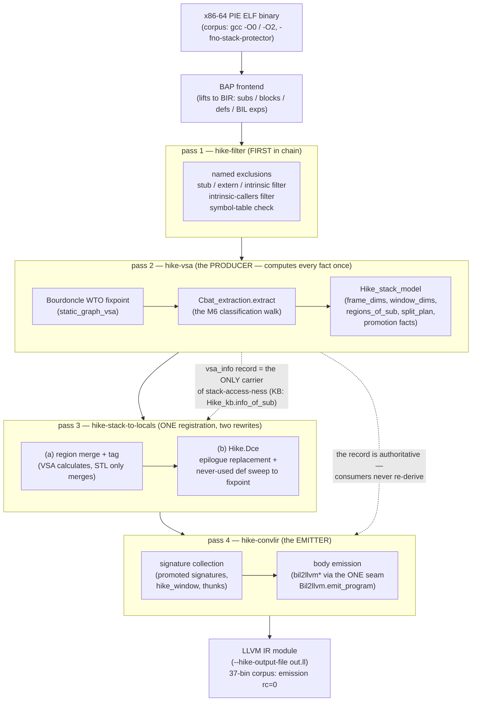
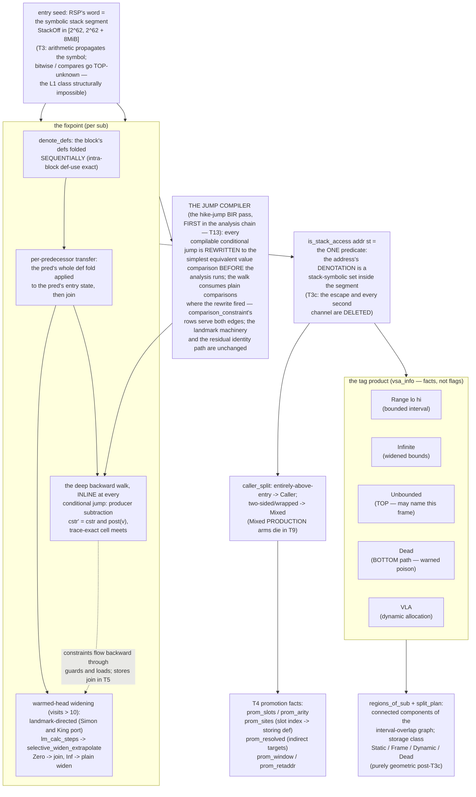
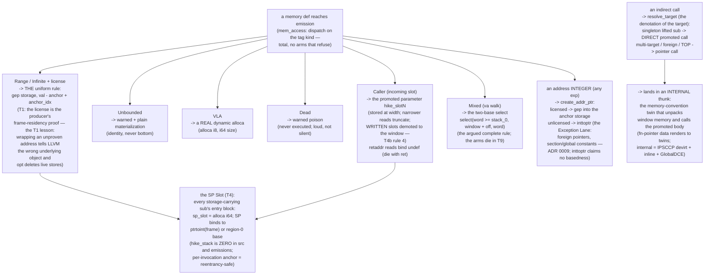
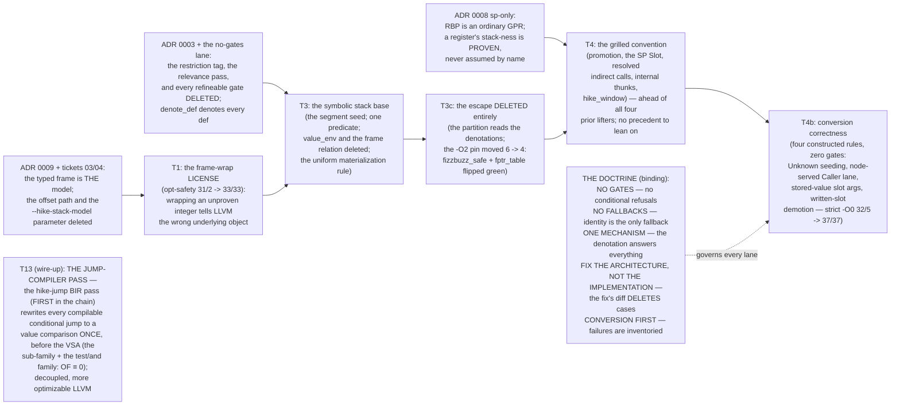
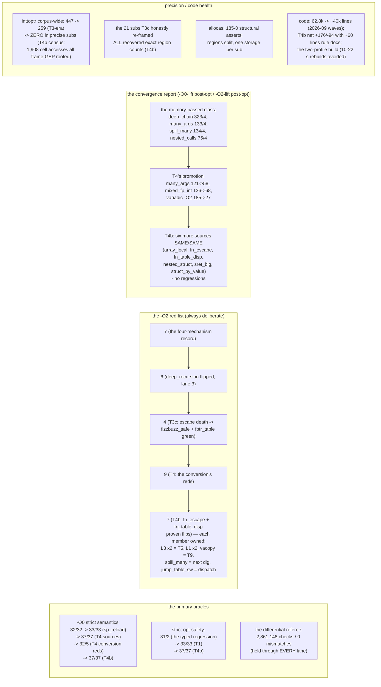
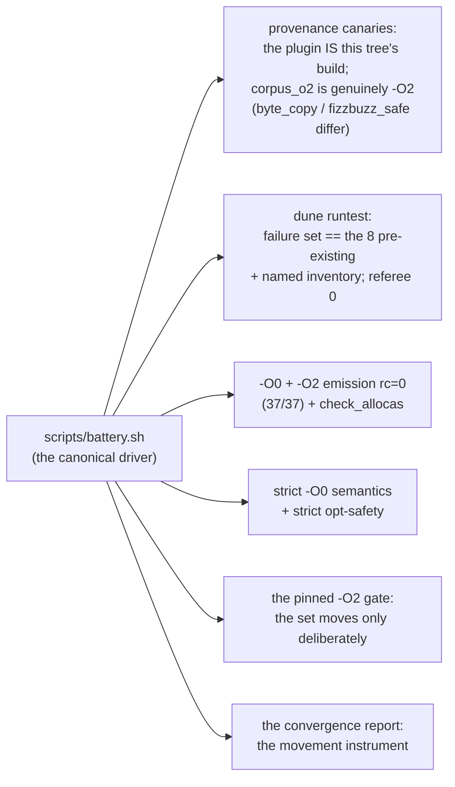

# hike — the complete architecture map (Mermaid)

One plugin, one pipeline, one mechanism. Generated 2026-09-11 from the
landed record (AGENTS.md validation blocks, ADRs 0001–0009, the
typed-model program's ticket verdicts). Read top-to-bottom: the
pipeline, the producer (VSA) internals, the stack model, the emitter
dispatch, the decision ledger, and the measured-gains ledger.

## 1. The pass pipeline (the plugin's spine)

## 2. The producer's internals (the ONE mechanism)

## 3. The emitter's dispatch (complete rules per tag kind)

## 4. The decision ledger (why the architecture is what it is)

## 5. The measured-gains ledger (every precision/speed movement)

## 6. The validation battery (what every lane must hold)

